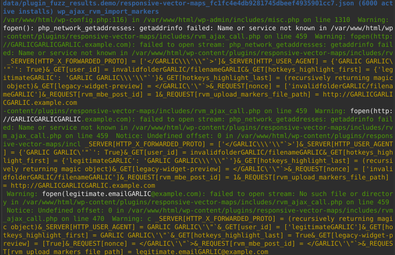
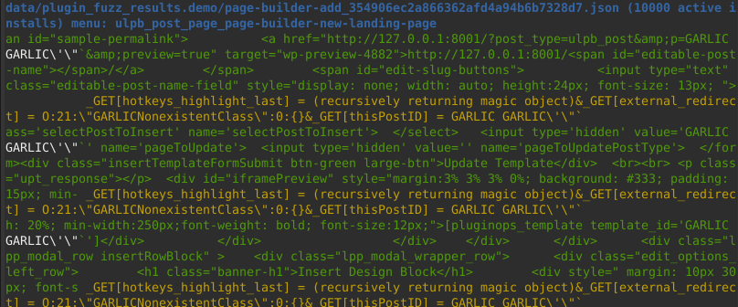
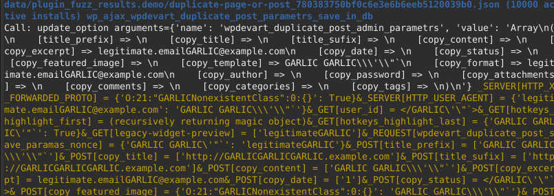

# wpgarlic
A proof-of-concept WordPress plugin fuzzer that led to the discovery of more than 300 vulnerabilities
in WordPress plugins installed on almost 30 million sites.

The used technique is described in https://kazet.cc/2022/02/03/fuzzing-wordpress-plugins.html

If you want to continue the research, start with less popular plugins - if a plugin
achieved at least 10k active installs between October 2021 and January 2024, I have
most probably looked at the fuzzer reports (and most focus has been put on plugins having
at least 20k active installs). Because there is a lot of randomness in how fuzzer works,
some vulnerabilities in these plugins remain undiscovered - but fewer ones.

**Fuzzer reports contain a lot of false positives - most of them don't indicate a vulnerability.
After seeing a report, first analyze whether the behavior you're observing is indeed a vulnerability
or a false positive. Don't spam WPScan/vendors with raw fuzzer reports - provide a PoC exploit
instead.**

## Examples
For obvious reasons, the examples will contain only vulnerabilities that have already been fixed.

### Arbitrary file read
Let's assume you are fuzzing `responsive-vector-maps` in version 6.4.0:

```
./bin/fuzz_object plugin responsive-vector-maps --version 6.4.0
```

(to fuzz the latest version, just skip `--version`).

After the fuzzing finishes (which would take 10-30 minutes for this plugin) you can call:

```
./bin/print_findings data/object_fuzz_results/
```

You will see, among others:

.

That means that the fuzzer detected executing `fopen()` on a known payload.
Most of the payloads contain the word `GARLIC` in them to facilitate automatic
detection in output. You may see or configure them in `docker_image/magic_payloads.php`.

Then, you may browse the source code and see that indeed the `wp_ajax_rvm_import_markers`
endpoint uses the file content to render output, thus allowing you to read arbitrary files
on the server: [CVE-2021-24947](https://wpscan.com/vulnerability/c6bb12b1-6961-40bd-9110-edfa9ee41a18).

What you see in white is a crash considered interesting (you may modify them or add new ones
in `crash_detectors.py`). Green is the context. In blue you see the report file name
(with plugin name), plugin popularity and endpoint name (here: the ajax action name).

The data in yellow are what payloads were injected into what variables.

### Reflected XSS
Let's assume you are fuzzing `page-builder-add` in version 1.4.9.4:

```
./bin/fuzz_object plugin page-builder-add --version 1.4.9.4
```

After printing the results, you will see known payload echoed back:

.

You can then manually test whether indeed this place (remember: in blue you have the
endpoint name, here: the menu page name) is vulnerable to XSS.
In this case, it is: [CVE-2021-25067](https://wpscan.com/vulnerability/365007f0-61ac-4e81-8a3a-3a068f2c84bc).

### Option update leading to stored XSS
```
./bin/fuzz_object plugin duplicate-page-or-post --version 1.4.6
```

After printing the results, you will see `update_option` being called:

.

Analysis of the endpoint's code will tell you that this indeed leads to a stored XSS
vulnerability: [CVE-2021-25075](https://wpscan.com/vulnerability/db5a0431-af4d-45b7-be4e-36b6c90a601b).

### False positives
Unfortunately, for most of the plugins the fuzzer doesn't find any interesting crashes, and for the rest, **most of the reports are false positives**. For example, if you see:

```
Call: wp_mail arguments={'to': 'plugin@pluginvendor.com', 'subject': '[Plugin contact]  - http://GARLICGARLICGARLIC.example.com'}
```

This can mean, that `wp_mail` is indeed called, but you don't control the recipient
and most of the subject. If you want to be sure, look at the plugin source.

### Additional tips for reading fuzzer reports

* If you see the message; *May as well be equal: ... and ...* - that means that the mechanism
  to pretend that a known payload is equal to any other string (described in
  https://kazet.cc/2022/02/03/fuzzing-wordpress-plugins.html#patched-equality) was triggered.
* If you see `__GARLIC_ACCESSED__ _FILES[files] __ENDGARLIC__` - that means that an uploaded
  file access was detected. No further checks are currently made - to check whether this is a
  vulnerability, look at the code.
* Sometimes what the fuzzer injects into GET, POST etc. parameters is not reproducible in the real world:
  for example, you can't inject anything into `$_GET['page']` if you want a particular menu page to be displayed.

## Usage cheatsheet
The first run of fuzzing or of the tests may take about an hour, because
we need to build the Docker image with instrumented PHP and WordPress.

### Fuzzing a plugin by name
```
./bin/fuzz_object plugin PLUGIN_SLUG
```

### Fuzzing a theme by name
```
./bin/fuzz_object theme THEME_SLUG
```

### Fuzzing a plugin from file
You can also install a plugin from a local zip file:

```
./bin/fuzz_object plugin PLUGIN_FILE_NAME.zip
```

### Printing findings
To print what the fuzzer found, use:
```
./bin/print_findings data/object_fuzz_results/
```

### Running tests
To run the tests, use:
```
./bin/test
```

Warning: the tests take long (more than an hour) and because they check whether the fuzzer
would find vulnerabilities, they fail with some probability.

### Reformatting code and running linters
wpgarlic uses `pre-commit` to run linters and format the code.
`pre-commit` is executed on CI to verify that the code is formatted properly.

To run it locally, use:

```
pre-commit run --all-files
```

To setup `pre-commit` so that it runs before each commit, use:

```
pre-commit install
```

## Manual testing environment
You may start a test environment with only one plugin installed using:

```
./bin/manual_testing PLUGIN_SLUG|PLUGIN_PATH.zip [version]
```

You can install a plugin using its slug or from a local zip file.

It will listen on http://127.0.0.1:8001/

There will be two test users in the database:

* username: admin, password: admin, privileges: administrator
* username: subscriber, password: subscriber, privileges: subscriber

## Extending and configuring the fuzzer
This tool is a proof of concept - **this section contains places where it can be improved to find
more vulnerabilities**.

You may want to edit `filtering.py` -- it contains the rules that deem a particular crash
important or not. If you change them, you may have more false positives, but find more vulnerabilities
as well. For example, the only header that I consider interesting when emitted is the Location
header, to detect Open Redirect vulnerabilities. That is just one idea and you may have others.

Another file that may be worth extending is `docker_image/patch_wordpress.sh`. It describes
calls to which functions will be logged as interesting.

If you want to inject other payloads (or change the probabilities with which they are injected)
edit `docker_image/magic_payloads.php` and `docker_image/fuzz/config.py`.

`crash_detector.py` contans regular expressions that find interesting crashes or interesting
information (e.g. e-mails) being exposed.

Fuzzing REST routes as logged-in admin has been disabled as it led to false positives.
Uncomment `rest_routes_admin` in  `config.DEFAULT_ENABLED_FEATURES` to change that.

## Fuzzer internals
### Blocklists
Some plugins need other ones (e.g. woocommerce) as a dependency. When fuzzing a plugin that has
a dependency, we want to fuzz only the chosen plugin and skip the dependency AJAX actions,
REST routes and menu pages. We want to fuzz woocommerce actions/routes/pages only when we picked
woocommerce to fuzz.

List of dependency actions/routes/pages are called blocklists and are listed in `docker_image/blocklists/`.
Files named `common` contain the WordPress core actions/routes/pages - we don't want to fuzz these
as well.

To update these blocklists, use `./bin/update_blocklists`.

## FAQ
### Fuzzer found something, is this a vulnerability?
Maybe. Install the plugin in a local test environment (for example you may use the one described in
the *Manual testing environment* section) and analyze the bug.

### Fuzzer found nothing, is the plugin secure?
**Don't assume that.** The fuzzer finds some classes of vulnerabilities, but has its limitations.

Fuzzer founds nothing for most of the plugins - the purpose of the tool is rather to massively
scan a large number of Wordpress plugins, not to perform comprehensive tests of a single plugin.

### Fuzzer found something in one run, but not in the next one. What happened?
This is possible. The fuzzer chooses payloads randomly, and introduces randomness in other places (e.g.
how the`==` operator should behave in cases described in
https://kazet.cc/2022/02/03/fuzzing-wordpress-plugins.html#patched-equality).

### Doesn't work? Have a question?
File a Github ticket or e-mail me: kazet@p4.team.
